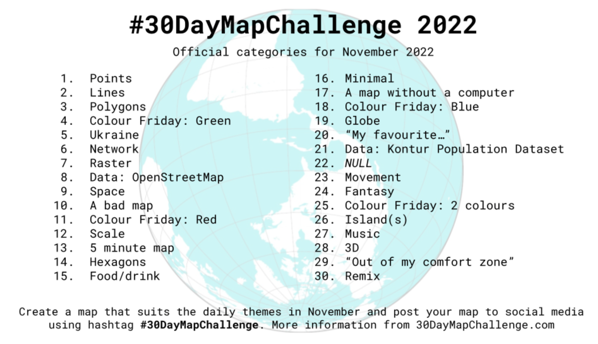
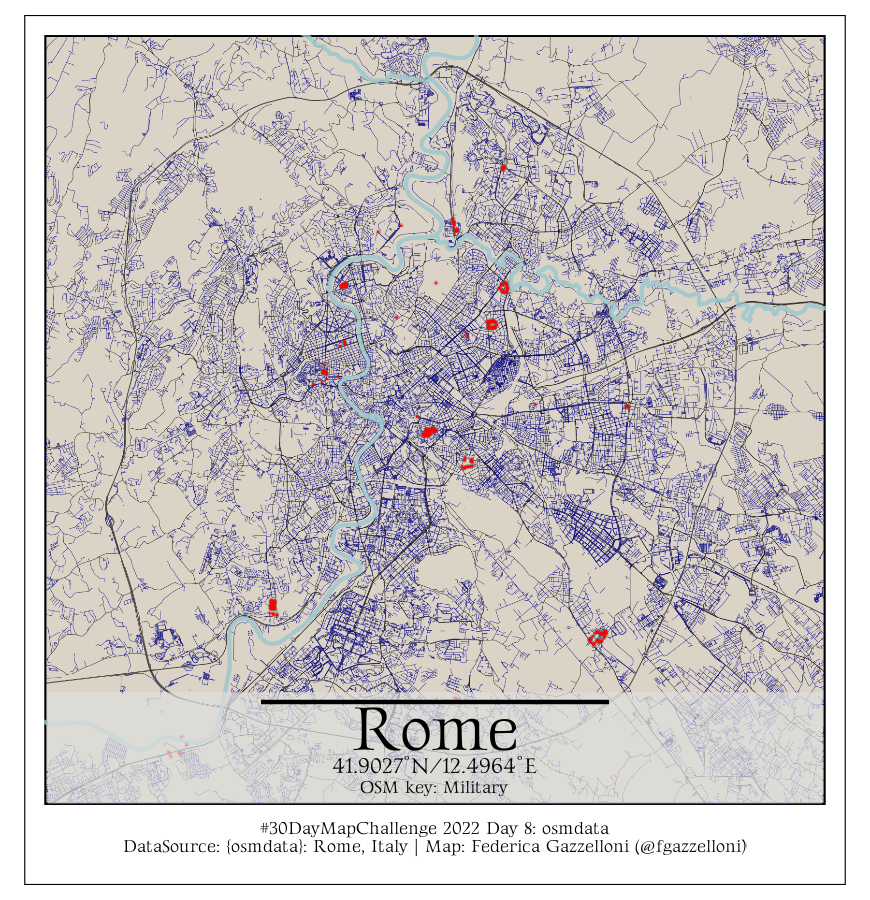
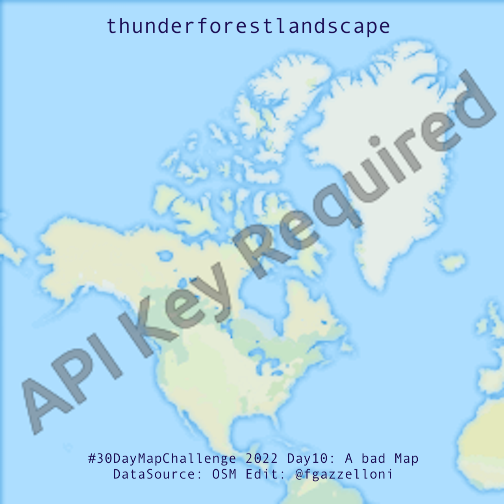
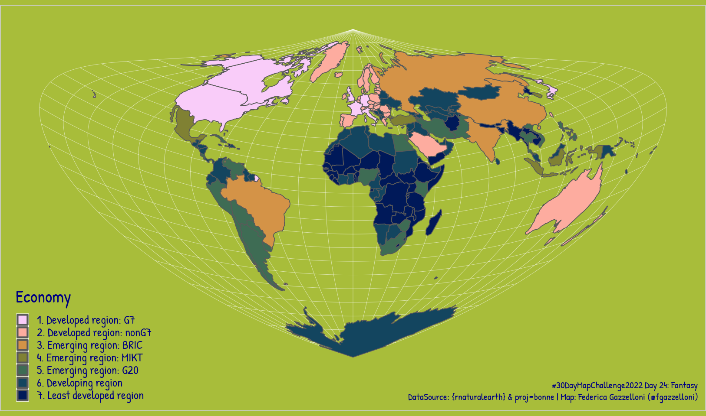

## #30DayMapChallenge 2022 daily social mapping project happening every November

[Federica Gazzelloni](https://github.com/Fgazzelloni) official maps repository

# my contributions are on [Twitter: \@fgazzelloni](https://twitter.com/fgazzelloni):

The [official repository for #30DayMapChallenge](https://github.com/tjukanovt/30DayMapChallenge) is a daily mapping challenge open to everyone. Creator: [Topi Tjukanov \@tjukanov](https://twitter.com/tjukanov)

The idea is to create maps based around different themes each day of November using the hashtag `#30DayMapChallenge`. You can prepare the maps beforehand, but the main idea is to publish maps on the dedicated days. Just include a picture of the map when you post to Twitter (or other platforms) with the hashtag. You don't have to sign up anywhere to participate. There are no restrictions on the tools, technologies or the data you use in your maps. Doing less than 30 is also fine. See the *Code of Conduct* at the bottom of the page.

<!-- TABLE START -->

| Day | Date         | Theme                           | Map                                                                                                                                                                                                                                            |
|------------------|------------------|------------------|--------------------|
| 1   | `01-11-2022` | Points                          |                                                                 |
| 2   | `02-11-2022` | Lines                           | [{width="256"}](https://github.com/Fgazzelloni/30DayMapChallenge/blob/master/2022/day2_lines/day2_lines.R)                                                          |
| 3   | `03-11-2022` | Polygons                        |                                                                     |
| 4   | `04-11-2022` | Colour Friday: Green            |  |
| 5   | `05-11-2022` | Ukraine                         |                                                                                     |
| 6   | `06-11-2022` | Network                         |                                                                                    |
| 7   | `07-11-2022` | Raster                          |                                                                                 |
| 8   | `08-11-2022` | Data: OpenStreetMap             |                                      |
| 9   | `09-11-2022` | Space                           |                                                                                                                                                                                                             |
| 10  | `10-11-2022` | A bad map                       |                                                                                                                                                                           |
| 11  | `11-11-2022` | Colour Friday: Red              |                                                                                                                                               |
| 12  | `12-11-2022` | Scale                           |                                                                                                                                                                                           |
| 13  | `13-11-2022` | 5 minute map                    |                                                                                                                                                              |
| 14  | `14-11-2022` | Hexagons                        |                                                                                                                                                                                 |
| 15  | `15-11-2022` | Food/drink                      |                                                                                                                                                                         |
| 16  | `16-11-2022` | Minimal                         |                                                                                                                                                                                     |
| 17  | `17-11-2022` | A map without a computer        |                                                                                                                                                 |
| 18  | `18-11-2022` | Colour Friday: Blue             |                                                                                                                                                                 |
| 19  | `19-11-2022` | Globe                           |                                                                                                                                                                                                     |
| 20  | `20-11-2022` | *"My favourite..."*             |                                                                                                                                                                                |
| 21  | `21-11-2022` | Data: Kontur Population Dataset |                                                                                                                                                            |
| 22  | `22-11-2022` | NULL                            |                                                                                                                                                                                                        |
| 23  | `23-11-2022` | Movement                        |                                                                                                                                                                                            |
| 24  | `24-11-2022` | Fantasy                         |                                                                                                                                                                                               |
| 25  | `25-11-2022` | Colour Friday: 2 colours        |                                                                                                                                                    |
| 26  | `26-11-2022` | Island(s)                       |                                                                                                                                                                                             |
| 27  | `27-11-2022` | Music                           |                                                                                                                                                                                                     |
| 28  | `28-11-2022` | 3D                              | The magnificent third dimension! Visualize something in 3D                                                                                                                                                                                     |
| 29  | `29-11-2022` | *"Out of my comfort zone"*      | Challenge yourself. Maybe a map using a new tool?                                                                                                                                                                                              |
| 30  | `30-11-2022` | Remix                           | Take a map that you've done during the month and do a new version. Or take a map you really like by someone else and do your own version.                                                                                                      |

<!-- TABLE END -->

The above table is also available as an [iCal calendar file](https://raw.githubusercontent.com/tjukanovt/30DayMapChallenge/main/themes.ical) for consumption by your favorite calendar/scheduling application.

## Data 🗺

You can use **what ever data you want.** But here are a few sources which could help you to get started or give you new ideas 👇

-   [OpenStreetMap](https://www.openstreetmap.org/)
    -   OpenStreetMap (OSM) is a collaborative project to create a free editable map of the world. If you seek for easy ways to get an extract of the data, you can check for [GeoFabrik](https://www.geofabrik.de/data/download.html) for Shapefiles or [osmdata.xyz](https://download.osmdata.xyz/) for GeoPackages or [Overpass API for GeoJSONs etc.](https://overpass-turbo.eu/) .
-   [Natural Earth Data](https://www.naturalearthdata.com/)
    -   Natural Earth is a public domain map dataset available at 1:10m, 1:50m, and 1:110 million scales. Featuring tightly integrated vector and raster data, with Natural Earth you can make a variety of visually pleasing, well-crafted maps with cartography or GIS software.
-   [Free GIS Data](https://freegisdata.rtwilson.com/)
    -   The site contains a categorised list of links to over 500 sites providing freely available geographic datasets - all ready for loading into a Geographic Information System.
-   [OS OpenData](https://www.ordnancesurvey.co.uk/opendatadownload/products.html)
    -   Ordnance Survey Open Data for Great Britain. Includes general topographic map data at a range of scales; useful thematic data such as greenspace, terrain, roads and rivers; postcode and place name georeferencing.
-   [Humanitarian Data Exchange](https://data.humdata.org/)
    -   Interesting datasets from around the world.
-   [LINZ Data Service](https://data.linz.govt.nz/)
    -   New Zealand land and sea data available for free under a Creative Commons licence via download or OGC APIs.
-   [LINZ NZ Aerial Basemap](https://basemaps.linz.govt.nz/)
    -   Current aerial imagery for New Zealand available under a Creative Commons licence via WMTS or XYZ tile services.
-   [Open Topography](https://opentopography.org/)
    -   Lidar point cloud and DEM data.
-   [A collective list of free APIs for use in software and web development.](https://github.com/public-apis/public-apis)
-   [GIS data repositories spreadsheet by Karen Payne](https://docs.google.com/spreadsheets/d/1utQRlrX3lJniBjWE3rNjLZeTRsbjH-zdjxNmXhhvO9Q/edit#gid=47)

## Tools 🔨🔧

Because the challenge is aimed to be open for everyone, the tools listed here will be *open source tools*. Still, **the challenge can be done with any kind of software** (or even without any software). Programming skills are not in any way a requirement to do the maps.

-   [QGIS](https://www.qgis.org/en/site/)
    -   A Free and Open Source Geographic Information System. A desktop software that allows you to read/write multiple data formats and output (mainly static) maps.
-   [Kepler](https://kepler.gl/)
    -   Open source geospatial analysis tool for large-scale data sets and for interactive maps.
-   [Aerialod](https://ephtracy.github.io/index.html?page=aerialod)
    -   Not really a GIS tool, but can be used to create some stunning 3D visualizations
-   [Blender](https://www.blender.org/)
    -   Free and open source 3D creation suite. Check out the BlenderGIS extension.
-   [R packages for geospatial](https://www.r-project.org/)
    -   [sf](https://cran.r-project.org/web/packages/sf/index.html), [ggplot](https://ggplot2.tidyverse.org/), [tmap](https://cran.r-project.org/web/packages/tmap/vignettes/tmap-getstarted.html) and [rayshader](https://www.rayshader.com/) to mention few examples.
-   [Python packages for geospatial](https://python.org/)
    -   [geopandas](https://geopandas.org/), [xarray-spatial](https://xarray-spatial.org), [matplotlib](https://matplotlib.org/2.0.2/gallery.html), [geoplot](https://residentmario.github.io/geoplot/), [hvplot](https://hvplot.holoviz.org/reference/index.html) and [plotly](https://plotly.com/python/) to mention a few.
-   [Mapshaper](https://mapshaper.org)
    -   Useful for geospatial data processing in the browser such as file format conversion, map projection, feature simplification, filtering, clipping, merging etc. Can also be run [locally from the command line](https://github.com/mbloch/mapshaper).
-   [Vega-Lite](https://vega.github.io/vega-lite/)
    -   Declarative visualization specification including [cartographic output](https://vega.github.io/vega-lite/examples/#maps-geographic-displays). Specifications can be written directly in JSON or via program language interfaces such as [altair](https://altair-viz.github.io) (Python) and [elm-vegalite](https://package.elm-lang.org/packages/gicentre/elm-vegalite/latest/VegaLite) (Elm). See, for example, this tutorial on using [OpenStreetMap with elm-vegalite](https://github.com/gicentre/litvis/blob/master/documents/tutorials/geoTutorials/openstreetmap.md)
-   [Vega](https://vega.github.io/vega/)
    -   More flexible but lower-level declarative visualization specification including cartographic output. Specifications can be written directly in JSON or via program language interfaces such [elm-vega](https://package.elm-lang.org/packages/gicentre/elm-vega/latest/).
-   [Litvis](https://github.com/gicentre/litvis)
    -   Literate Visualization notebook environment optimised for specifying visualizations and documenting the design process. While not specific to cartography, can be a useful environment for exploring cartographic design.
-   [Observable](https://observablehq.com)
    -   Reactive notebook environment for generation of visualization and cartographic output embedded in a textual narrative. Focus is on using [d3](https://d3js.org) for specifying visual output.

## Tutorials + helpful resources 📚

If you want to make maps with QGIS, this video is a great starting point. Check out also other videos by [Klas Karlson](https://www.youtube.com/playlist?list=PLNBeueOmuY163iwu4VpZdjqqdU1HkRTP_) - [Excellent QGIS introduction YouTube series by Steven Bernard](https://www.youtube.com/playlist?list=PL7HotvlLKHCs9nD1fFUjSOsZrsnctyV2R) - [QGIS Tutorials and Tips by Ujaval Gandhi](https://www.qgistutorials.com/en/) - [Tutorial on how to make 3D landscapes and city models by Alasdair Rae](http://www.statsmapsnpix.com/2020/03/making-3d-landscape-and-city-models.html) - [Blog post by Kenneth Field about the basics of mapmaking](https://medium.com/nightingale/so-you-want-to-make-a-map-58c7f55f6b20)

## Maps &stats

In 2021 there were more than 1200 mappers and more than 9000 maps created for the challenge. In 2020 more than 1000 people posted more than 7000 maps for the challenge on different platforms. If you want to see some maps from past challenges, browse the hashtag on [Twitter](https://twitter.com/search?q=%2330DayMapChallenge&src=typed_query) or check the official [website](https://30daymapchallenge.com/) of the challenge and browse different years.

[#30DayMapChallenge bot by Haifeng Niu harvested comprehensive stats and maps from the challenge](https://github.com/hn303/30DayMapChallenge-Bot)

In 2020 & 2019 David Friggens did a huge lift on the [30DayMapChallenge2020Metadata repository](https://github.com/dakvid/30DayMapChallenge2020Metadata) with metadata & interactive gallery. \## Code of Conduct No matter if you are a GIS expert or never made a map before this challenge, everyone is welcome to participate,

But keep in mind a few things: - All maps you publish have to be **your original work**. Don't steal content from others. - Give **credit to the original data source** whenever possible. - The challenge is all about **creativity, openness and the joy of beautiful maps and cartography.** It is not a competition, - **Don't be an asshole**.

Inspiration for the challenge came from [Inktober](https://inktober.com/) and [Tidy Tuesday](https://github.com/rfordatascience/tidytuesday).
