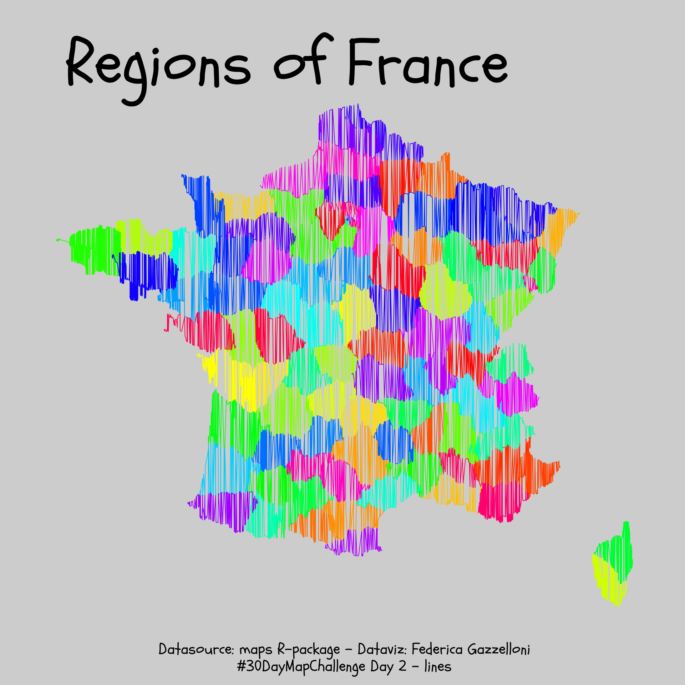
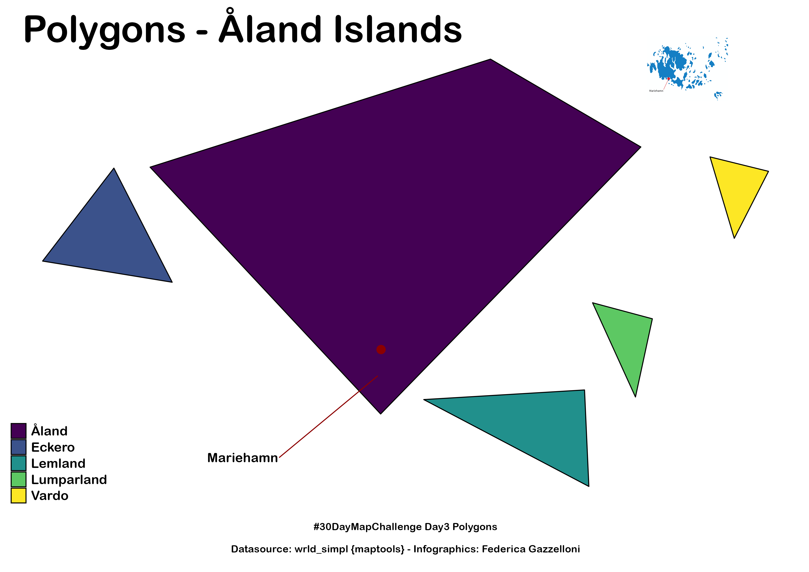
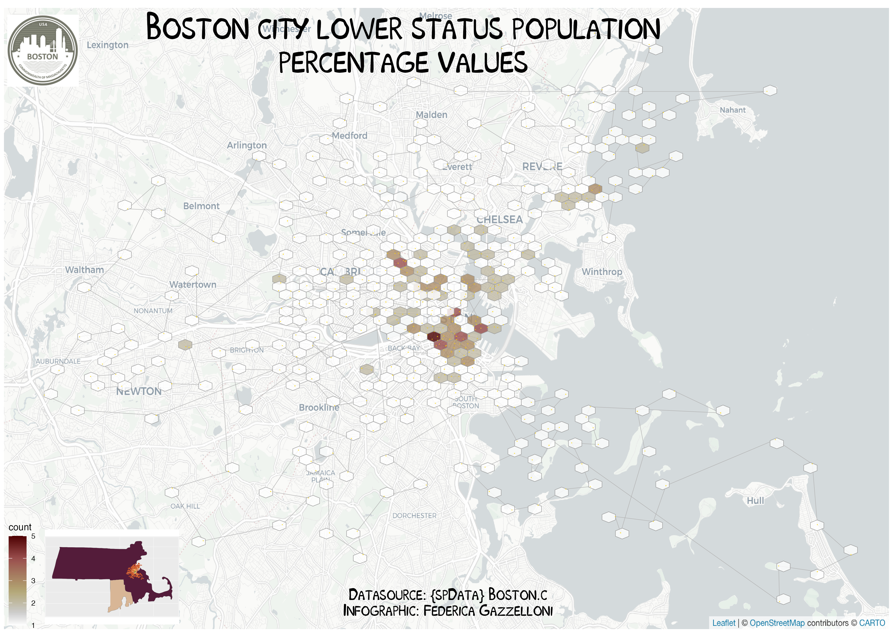
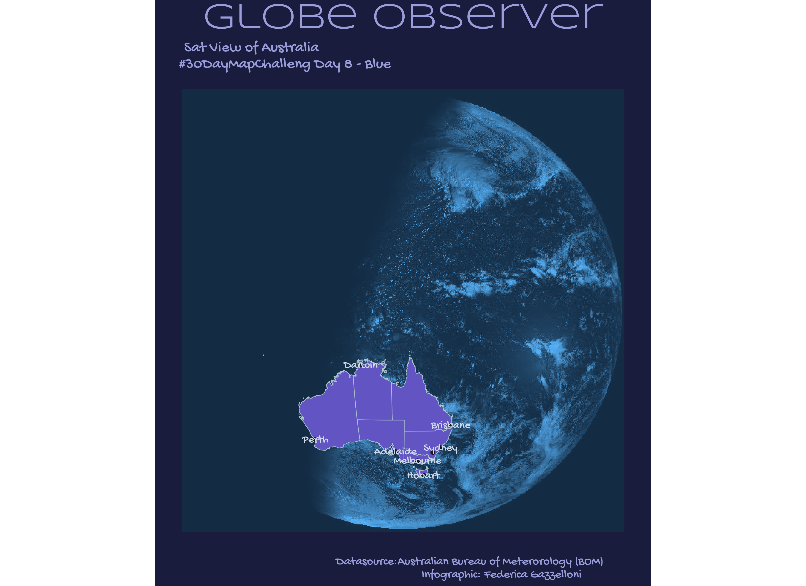

This is my #30DayMapChallenge repository fork of [Topi Tjukanov official repo](https://github.com/tjukanovt/30DayMapChallenge)

# my contributions [Twitter: @fgazzelloni](https://twitter.com/fgazzelloni):

- [30DayChartChallenge-2021](https://github.com/Fgazzelloni/rstats-chart-challenge-2021)
- [TidyTuesday](https://github.com/Fgazzelloni/TidyTuesday)

# #30DayMapChallenge 🌎🌏🌎 schedule:

## Themes 📆

## Day 1 
01-11-2021 | **Points** | A map with points
                                                                                                                                                     
# Day 2 
02-11-2021 | **Lines** | A map with lines
                                                                                                                                                  
## Day 3 
03-11-2021 | **Polygons** | A map with polygons
                                                                                                                                                    
## Day 4 
04-11-2021 | **Hexagons** | A map with hexagons
                                                                                                                                                        
## Day 5 
05-11-2021 | **Data challenge 1: OpenStreetMap**| OpenStreetMap is **the** source for geospatial data. Use OSM to map something that is interesting to you. You can access the data e.g. from [GeoFabrik](https://www.geofabrik.de/data/download.html) or some of [these](https://learnosm.org/en/osm-data/getting-data/) sources. Remember to credit '© OpenStreetMap contributors'
   

## Day 6 
06-11-2021 | **Red**| A map with red colour or a map about something red. 
                

## Day 7 
07-11-2021 | **Green**| A map with green colour or a map about something green
  

## Day 8 
08-11-2021 | **Blue** | A map with blue colour or a map about something blue
                                                                                                                                 

## Day 9 
09-11-2021 | **Monochrome** | A monochromic image is composed of one color (or values of one color). So for example black and white maps are valid here. [See some inspiration from the great monochrome mapping competition](https://somethingaboutmaps.wordpress.com/monocarto-2019-winners/) (although those masterpieces took a bit more than a day to make, probably)
     

## Day 10 
10-11-2021 | **Raster** | Nothing stops you from doing almost all of the maps with raster data. But this day is dedicated to those lovely pixels
     

## Day 11 
11-11-2021 | **3D** | The magnificent third dimension! Visualize something in 3D
     

## Day 12 
12-11-2021 | **Population** | That is you and me. Or maybe animal population from [Movebank.org](https://www.movebank.org/cms/movebank-main)? Anyhow a classic theme for thematic maps
     

## Day13 13-11-2021 | **Data challenge 2: Natural Earth** | Great public domain map dataset for cartography on global and national scales. You can use Natural Earth as a part of your map or as the main source. You can download the data from a few different locations, but probably the easiest access is via [GitHub](https://github.com/nvkelso/natural-earth-vector/tree/master/geojson) or the [Natural Earth homepage](https://www.naturalearthdata.com/)
    

## Day 14 
14-11-2021 | **Map with a new tool** | As the whole #30DayMapChallenge is much about learning and experimenting, this day is dedicated to exploring new tools. See the list on this repo below or find something interesting yourself!

## Day 15
15-11-2021 | **Map made without using a computer** | Title speaks for itself. Use pen & paper, [carrots](https://twitter.com/lacxrx/status/1326763865460367361?s=20) or something else
     

## Day 16 
16-11-2021 | **Urban/rural** | Map an urban area or rural area. Or something that defines that place
   

## Day 17 
17-11-2021 | **Land** | Land, landcover, landuse... You choose
     

## Day 18 
18-11-2021 | **Water** | Oceans, lakes, rivers or something completely different
     

## Day 19 
19-11-2021 | **Island(s)** | Islands in the water, islands of innovation or something completely different
     

## Day 20 
20-11-2021 | **Movement** | Visualizing movement can be done with a static map or with an animation. I [have written a blog post](https://www.gispo.fi/en/open-software/geogiffery-in-2020-with-qgis-temporal-controller/)recently on how to make animations with QGIS 
     

## Day 21 
21-11-2021 | **Elevation** | Sweet hillshades, beautiful contours, high mountains or low valleys.  DEM, DSM or something else
     

## Day 22 
22-11-2021 | **Boundaries** | Boundaries are all around us. Some of them are visible and some of them are in our heads
     

## Day 23 
23-11-2021 | **Data challenge 3: GHSL Global Human Settlement Layer**| The third data challenge should be created using this great dataset by EC JRC on human population. You can find it [here](https://ghsl.jrc.ec.europa.eu/). Different resolutions and areas you can choose from
     

## Day 24 
24-11-2021 | **Historical map** | Historical data, historical style or something else
     

## Day 25 
25-11-2021 | **Interactive map** | What if the user wants to click, pan and explore your map? If you don't feel comfortable with programming, one easy way is to use [qgis2web](https://github.com/tomchadwin/qgis2web) plugin. Or try out for example [kepler.gl](https://kepler.gl/) or [Unfolded Studio](https://studio.unfolded.ai/home)
     

## Day 26 
26-11-2021 | **Choropleth map** | A choropleth map is a type of thematic map in which a set of pre-defined areas is colored or patterned in proportion to a statistical variable that represents an aggregate summary of a geographic characteristic within each area, such as population density or per-capita income. (Source: [Wikipedia](https://en.wikipedia.org/wiki/Choropleth_map))
     

## Day 27 
27-11-2021 | **Heatmap** | A heat map (or heatmap) is a data visualization technique that shows magnitude of a phenomenon as color in two dimensions. The variation in color may be by hue or intensity, giving obvious visual cues to the reader about how the phenomenon is clustered or varies over space. (Source: [Wikipedia](https://en.wikipedia.org/wiki/Heat_map))
     

## Day 28 
28-11-2021 | **The Earth is not flat** | The Earth isn’t flat (AFAIK), so how would you show that on a map? Maybe something creative with projections? You can use e.g. [this QGIS plugin.](https://github.com/GispoCoding/GlobeBuilder)
     

## Day 29 
29-11-2021 | **NULL** 
            

## Day 30 
30-11-2021 | **Metamapping day** | Final day! Spend the day either by 1) collecting your entries from the challenge to a common gallery, 2) writing a tutorial or a blog post on one of your maps or 3) create a map from a theme you have chosen yourself
     

## Data 🗺

You can use **what ever data you want.** But here are a few sources which could help you to get started or give you new ideas 👇

- [OpenStreetMap](https://www.openstreetmap.org/)
	- OpenStreetMap (OSM) is a collaborative project to create a free editable map of the world. If you seek for easy ways to get an extract of the data, you can check for [GeoFabrik](https://www.geofabrik.de/data/download.html) for Shapefiles or [osmdata.xyz](https://download.osmdata.xyz/) for GeoPackages or [Overpass API for GeoJSONs etc.](https://overpass-turbo.eu/) .
- [Natural Earth Data](https://www.naturalearthdata.com/)
	- Natural Earth is a public domain map dataset available at 1:10m, 1:50m, and 1:110 million scales. Featuring tightly integrated vector and raster data, with Natural Earth you can make a variety of visually pleasing, well-crafted maps with cartography or GIS software.
- [Free GIS Data](https://freegisdata.rtwilson.com/)
	- The site contains a categorised list of links to over 500 sites providing freely available geographic datasets - all ready for loading into a Geographic Information System.
- [OS OpenData](https://www.ordnancesurvey.co.uk/opendatadownload/products.html)
	- Ordnance Survey Open Data for Great Britain. Includes general topographic map data at a range of scales; useful thematic data such as greenspace, terrain, roads and rivers; postcode and place name georeferencing.
- [Humanitarian Data Exchange](https://data.humdata.org/)
	- Interesting datasets from around the world.
- [LINZ Data Service](https://data.linz.govt.nz/)
	- New Zealand land and sea data available for free under a Creative Commons licence via download or OGC APIs.
- [LINZ NZ Aerial Basemap](https://basemaps.linz.govt.nz/)
	- Current aerial imagery for New Zealand available under a Creative Commons licence via WMTS or XYZ tile services.
- [Open Topography](https://opentopography.org/)
	- Lidar point cloud and DEM data.
- [A collective list of free APIs for use in software and web development.](https://github.com/public-apis/public-apis)
- [GIS data repositories spreadsheet by Karen Payne](https://docs.google.com/spreadsheets/d/1utQRlrX3lJniBjWE3rNjLZeTRsbjH-zdjxNmXhhvO9Q/edit#gid=47)

## Tools 🔨🔧

Because the challenge is aimed to be open for everyone, the tools listed here will be *open source tools*. Still, **the challenge can be done with any kind of software** (or even without any software). Programming skills are not in any way a requirement to do the maps.

 - [QGIS](https://www.qgis.org/en/site/)
	 - A Free and Open Source Geographic Information System. A desktop software that allows you to read/write multiple data formats and output (mainly static) maps.
 - [Kepler](https://kepler.gl/)
	 - Open source geospatial analysis tool for large-scale data sets and for interactive maps.
 - [Aerialod](https://ephtracy.github.io/index.html?page=aerialod)
	 - Not really a GIS tool, but can be used to create some stunning 3D visualizations
 - [Blender](https://www.blender.org/)
	 - Free and open source 3D creation suite. Check out the BlenderGIS extension.
 - [R packages for geospatial](https://www.r-project.org/)
	 - [sf](https://cran.r-project.org/web/packages/sf/index.html), [ggplot](https://ggplot2.tidyverse.org/), [tmap](https://cran.r-project.org/web/packages/tmap/vignettes/tmap-getstarted.html) and [rayshader](https://www.rayshader.com/) to mention few examples.
 - [Mapshaper](https://mapshaper.org)
	 - Useful for geospatial data processing in the browser such as file format conversion, map projection, feature simplification, filtering, clipping, merging etc. Can also be run [locally from the command line](https://github.com/mbloch/mapshaper).
 - [Vega-Lite](https://vega.github.io/vega-lite/)
	 - Declarative visualization specification including [cartographic output](https://vega.github.io/vega-lite/examples/#maps-geographic-displays). Specifications can be written directly in JSON or via program language interfaces such as [altair](https://altair-viz.github.io) (Python) and [elm-vegalite](https://package.elm-lang.org/packages/gicentre/elm-vegalite/latest/VegaLite) (Elm). See, for example, this tutorial on using [OpenStreetMap with elm-vegalite](https://github.com/gicentre/litvis/blob/master/documents/tutorials/geoTutorials/openstreetmap.md)
 - [Vega](https://vega.github.io/vega/)
	 - More flexible but lower-level declarative visualization specification including cartographic output. Specifications can be written directly in JSON or via program language interfaces such [elm-vega](https://package.elm-lang.org/packages/gicentre/elm-vega/latest/).
 - [Litvis](https://github.com/gicentre/litvis)
	 - Literate Visualization notebook environment optimised for specifying visualizations and documenting the design process. While not specific to cartography, can be a useful environment for exploring cartographic design.
 - [Observable](https://observablehq.com)
	 - Reactive notebook environment for generation of visualization and cartographic output embedded in a textual narrative. Focus is on using [d3](https://d3js.org) for specifying visual output.

## Tutorials + helpful resources 📚
If you want to make maps with QGIS, this video is a great starting point. Check out also other videos by [Klas Karlson](https://www.youtube.com/playlist?list=PLNBeueOmuY163iwu4VpZdjqqdU1HkRTP_):

- [Excellent QGIS introduction YouTube series by Steven Bernard](https://www.youtube.com/playlist?list=PL7HotvlLKHCs9nD1fFUjSOsZrsnctyV2R)
- [QGIS Tutorials and Tips by Ujaval Gandhi](https://www.qgistutorials.com/en/)
- [Tutorial on how to make 3D landscapes and city models by Alasdair Rae](http://www.statsmapsnpix.com/2020/03/making-3d-landscape-and-city-models.html)
- [Blog post by Kenneth Field about the basics of mapmaking](https://medium.com/nightingale/so-you-want-to-make-a-map-58c7f55f6b20)

## Maps, stats and results
In 2020 more than 1000 people posted more than 7000 maps for the challenge on different platforms.

[#30DayMapChallenge bot by Haifeng Niu harvested comprehensive stats and maps from the challenge](https://github.com/hn303/30DayMapChallenge-Bot)   

Check the [30DayMapChallenge2020Metadata repository](https://github.com/dakvid/30DayMapChallenge2020Metadata) by David Friggens and give your contribution there. The aim there is to create an interactive gallery of the results.

## Code of Conduct

- All maps you publish have to be **your original work**. Don’t steal content from others.
- Give **credit to the original data source** whenever possible.
- The challenge is all about **creativity, openness and the joy of beautiful maps and cartography.** It is not a competition,
- **Don’t be an asshole**.
